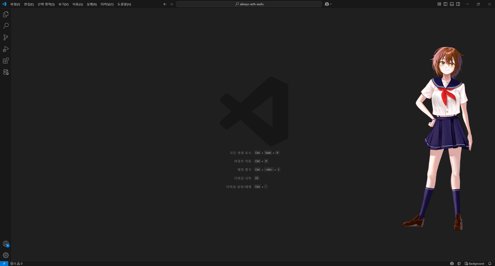

# Always With your Waifu

<br>

기본 일러스트 - [Harido](https://x.com/haridodesu)<br>
Languages: [English](README.en.md) | 한국어

## 개요
Waifu will always be with you <br>
⚠️ 이 프로그램은 window 7 이후 환경에서 작동합니다<br>
⚠️ 아직 다른 os는 지원하지 않습니다 
<br>


## 사용법
- [여기서](https://github.com/wkdvp/always-with-waifu/releases/tag/v1.0) 
Always_with_waifu.zip을 다운받고 압축을 풀어주세요
- 목소리, 이미지 파일을 각각 image, voice 폴더에 저장해 주세요
- image와 voice 폴더는 캐릭터 이름으로 된 폴더 안에 저장해 주세요
``` bash
├── aww.exe         # 메인 실행 파일
├── setting.txt     # 초기 설정 파일
└── source
    └── [WAIFU_NAME]
        ├── config.txt      # 캐릭터별 설정
        ├── image           # 이미지 파일 폴더
        │   └── *.png
        └── voice           # 음성 파일 폴더
            └── *.mp3
```
### config.txt
- config.txt는 캐릭터별 반응을 정의하는 파일입니다
- 첫 줄에 기본으로 띄울 이미지를 작성해 주세요
- 다음 줄 부터는 반응할 이미지와 목소리를 적어주세요
- 같이 재생할 이미지와 목소리는 **"한 줄에" "띄어쓰기로 구분해"** 적어주세요

```
default.png
surprise.png nani.mp3
...
```
### setting.txt
- setting.txt는 이미지의 크기와 위치를 설정하는 파일입니다
- 이미지의 가로 크기, 세로 크기, x좌표, y좌표를 **백분율**로 작성해 주세요
- 다음 줄에는 사용할 캐릭터명을 작성해 주세요
```
100 100 100 100
skm
```

- 실행 후 캐릭터를 클릭하면 대화할 수 있습니다

<br>
<br>

> 국방의 의무를 다하던 중에도 흔쾌히 그림을 그려주신 Harido 작가님께 감사를 드립니다

<br>
<br>
<br>
<br>


#### 실례가 아니라면....


[](https://ko-fi.com/V7V51EOBCF)
<p style="font-size:10px"> 한잔만ㅎㅎ; </p>
